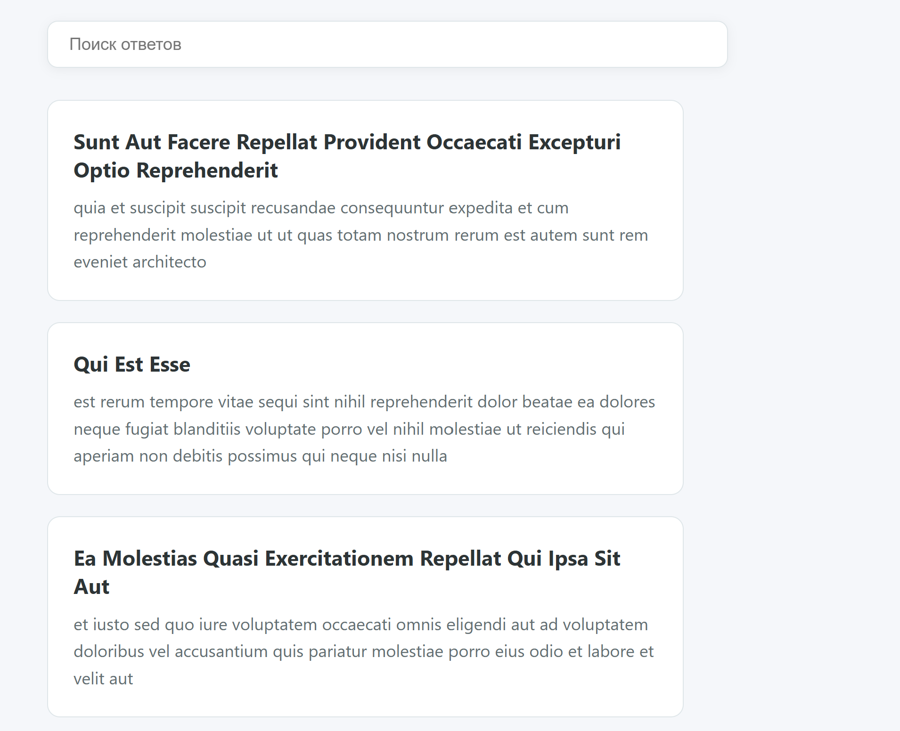
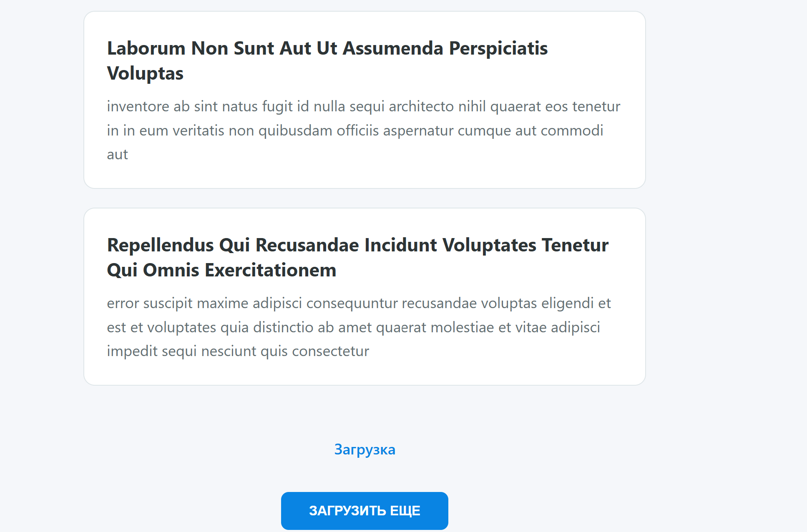

# 🔍 Interactive Posts Feed

> 🚀 **Live Demo:** [Watch the demo in the browser](https://voldy831.github.io/javascript-project-2/)

# 🔍 Interactive Posts Feed with Live Search & Infinite Scroll

A lightweight, responsive front-end application that fetches, searches, and displays posts from an external API with real-time debounced search, manual pagination, and automatic infinite scrolling.

---

## 📋 Features

- ⚡ **Real-Time Live Search**: Instant searching across posts with built-in **debouncing** (300ms delay) to minimize API requests.
- ♾️ **Infinite Scroll**: Automatically loads more posts as the user scrolls down using the **Intersection Observer API**.
- 🔘 **Manual Pagination**: Alternative "Load More" button with disabled states when no more items are available.
- 🛡️ **Robust State & Error Handling**: Visual indicators for loading states, fetch errors, and "No results found" scenarios.
- 🎨 **Modern & Sticky UI**: Sticky search bar with clean CSS custom properties (variables) and responsive design.

---

## 🛠️ Tech Stack

- **HTML5**: Semantic document structure.
- **CSS3**: Modern styling using CSS variables, flexbox, sticky positioning, and custom typography.
- **JavaScript (ES6+)**:
  - `fetch` API for asynchronous HTTP requests.
  - `IntersectionObserver` for seamless infinite scrolling.
  - Debounce logic via `setTimeout` / `clearTimeout`.
- **API**: [JSONPlaceholder](https://jsonplaceholder.typicode.com/) for mock post data.

---
